# hmis-repo01

### Estudiante de Ingeniería informática. Asignatura: Herramientas y Métodos de Ingeniería del Software.

**Cambios en la rama readme-edits**

# Ejercicios de git branching

## Nivel principal

### Una breve introducción a la mayoría de los comandos de git

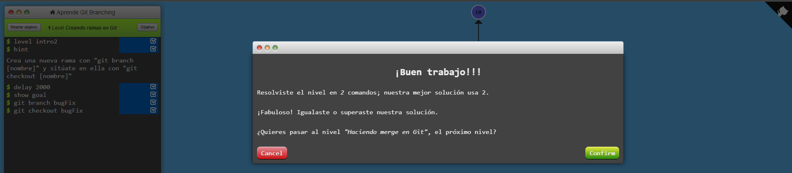
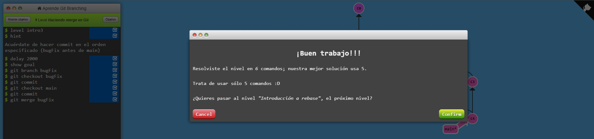
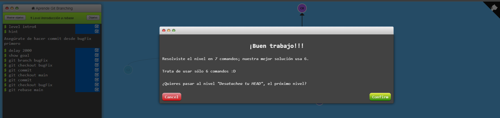

### La próxima ración de git. Espero que estés hambriento
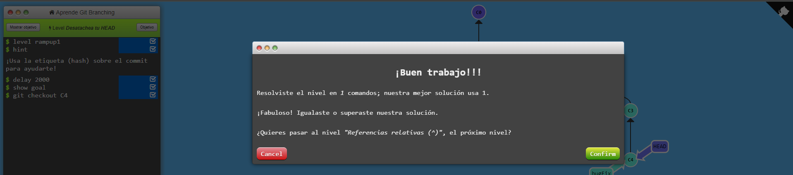
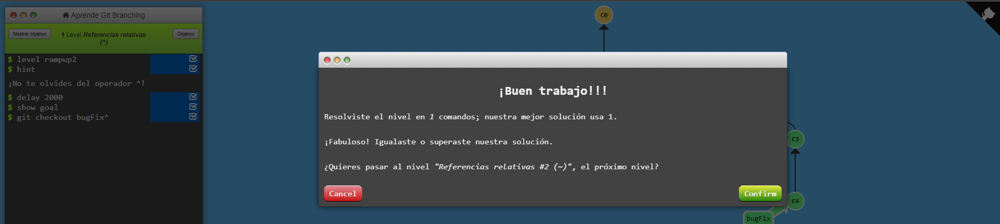
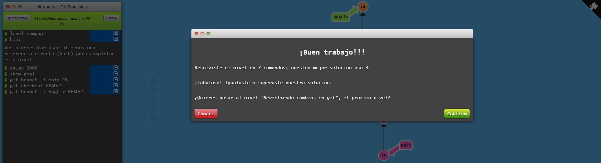
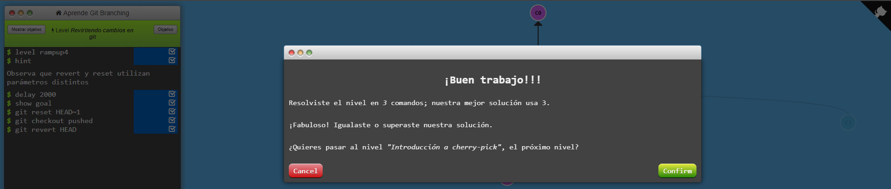

### Ponte cómodo cuando modifiques el directorio fuente

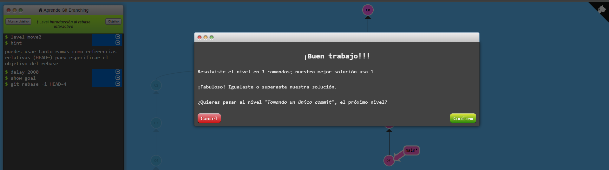

### Un batiburrillo de técnicas, trucos y sugerencias sobre Git
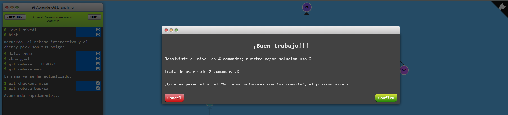
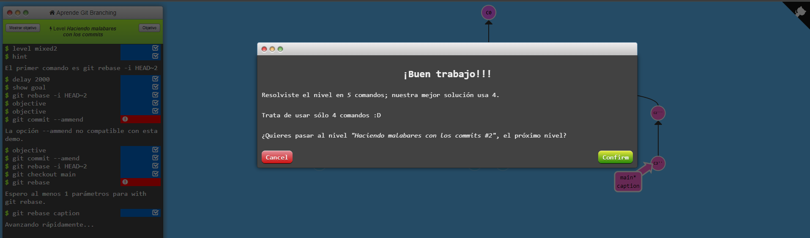
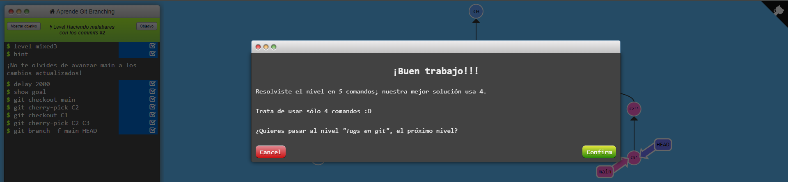
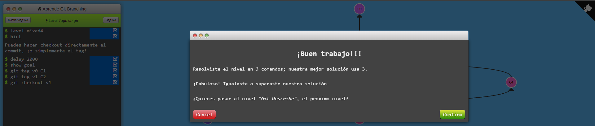
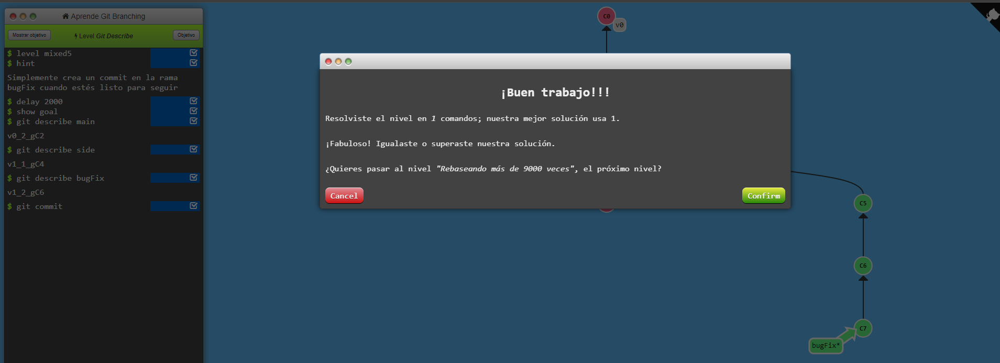

### ¡Para los verdaderos valientes!
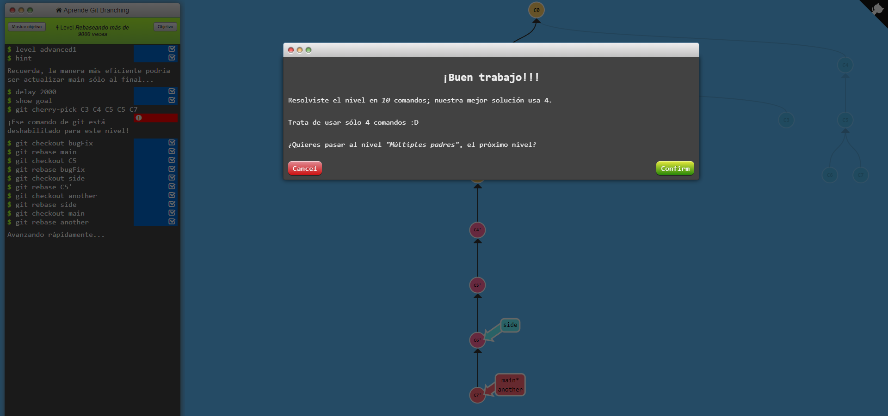
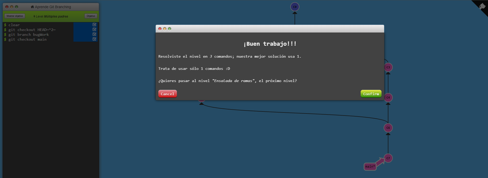
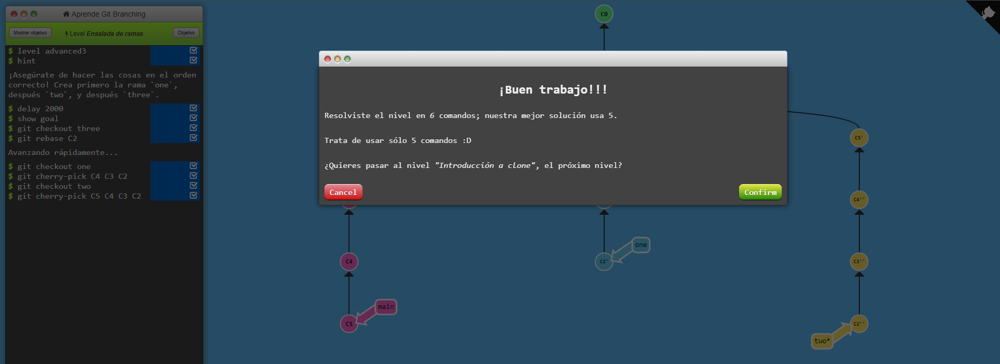

### **Nivel principal completado**
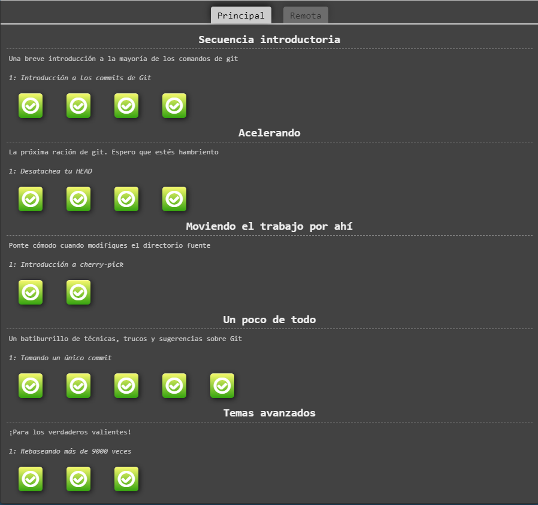

## Nivel remota

### Hora de compartir vuestros 1's y 0's, chicos; programar se volvió social!
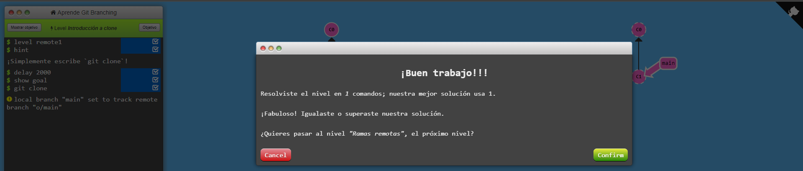
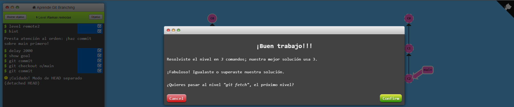
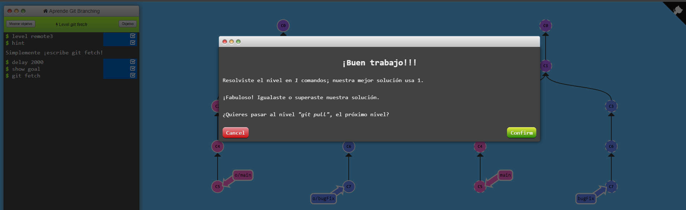
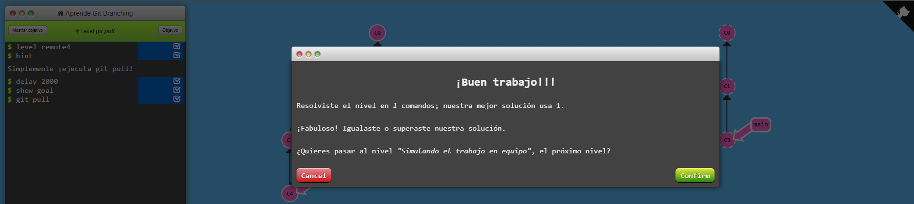
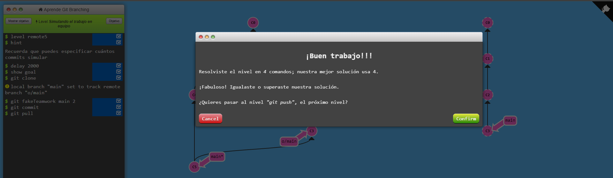
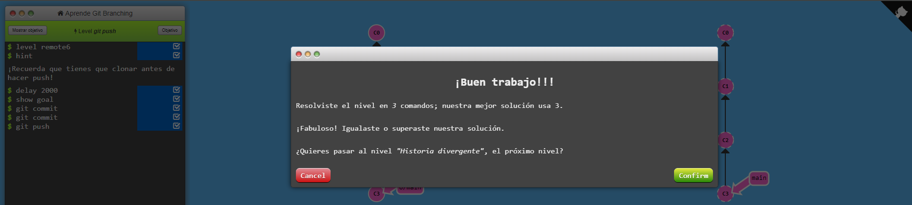
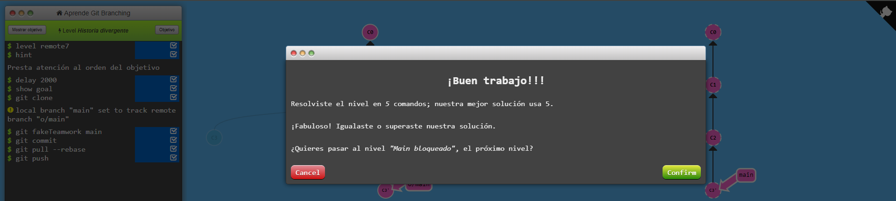
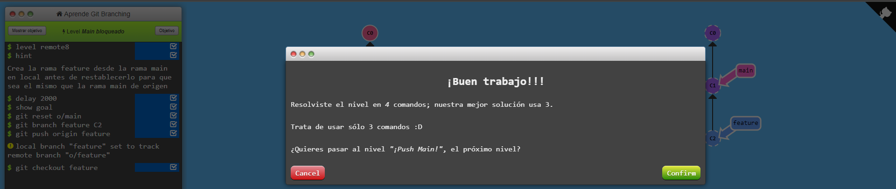

### Hasta el origen y más allá -- Git Remotes avanzado!
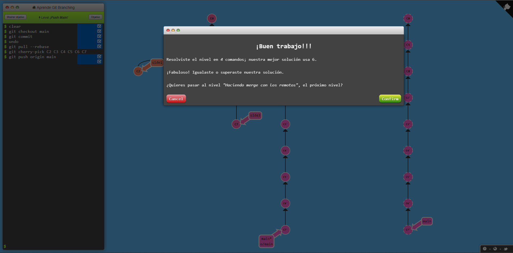
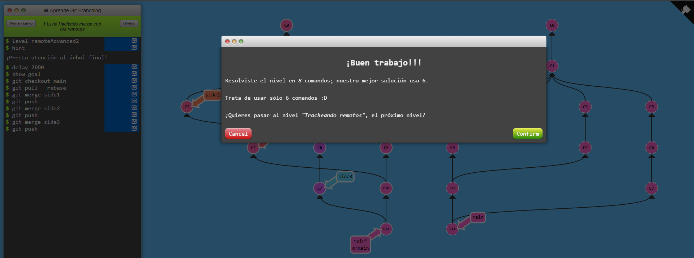
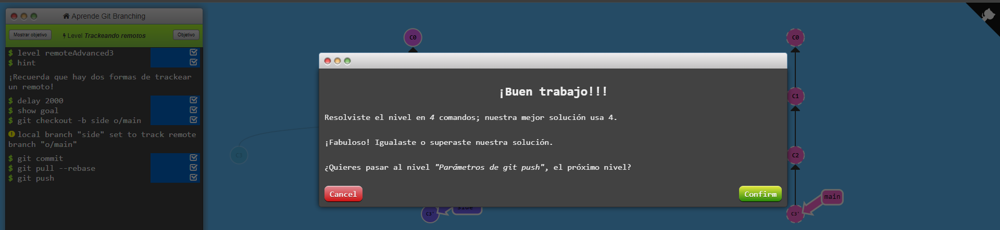
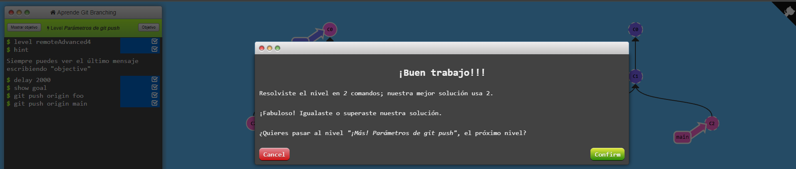
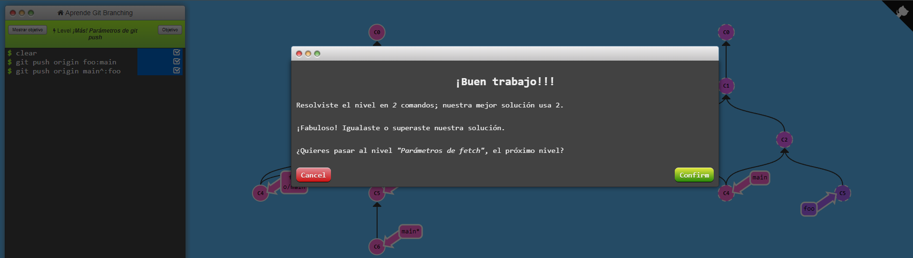
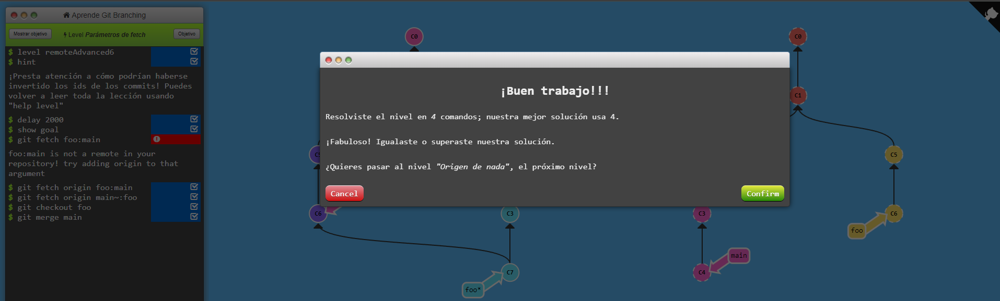

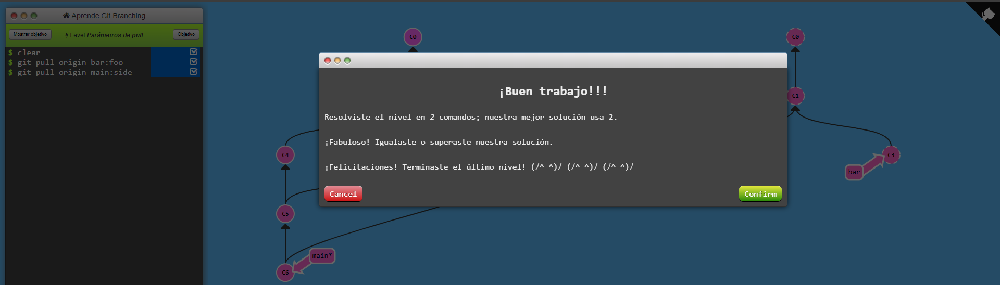

### **Nivel remoto completado**
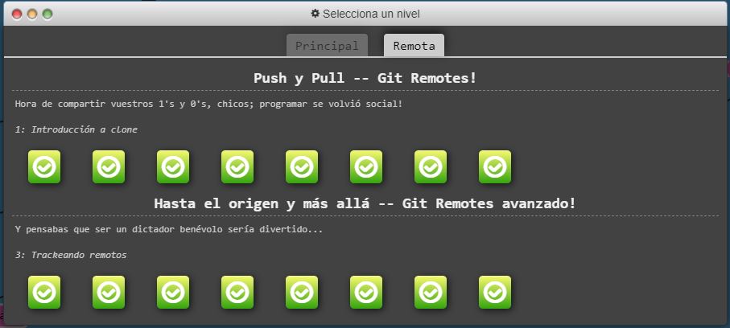