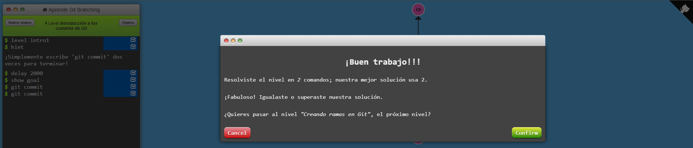
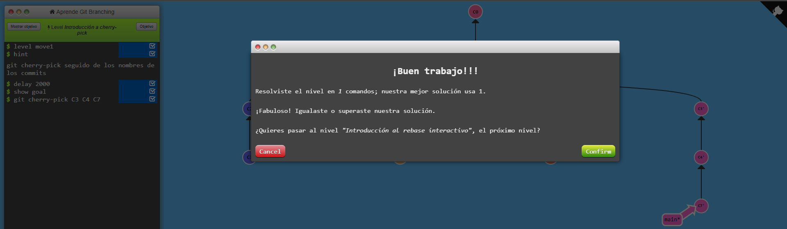

# hmis-repo01

### Estudiante de Ingeniería informática. Asignatura: Herramientas y Métodos de Ingeniería del Software.

**Cambios en la rama readme-edits**

# Ejercicios de git branching

## Intro

## Rampup

## Move

## Mixed
